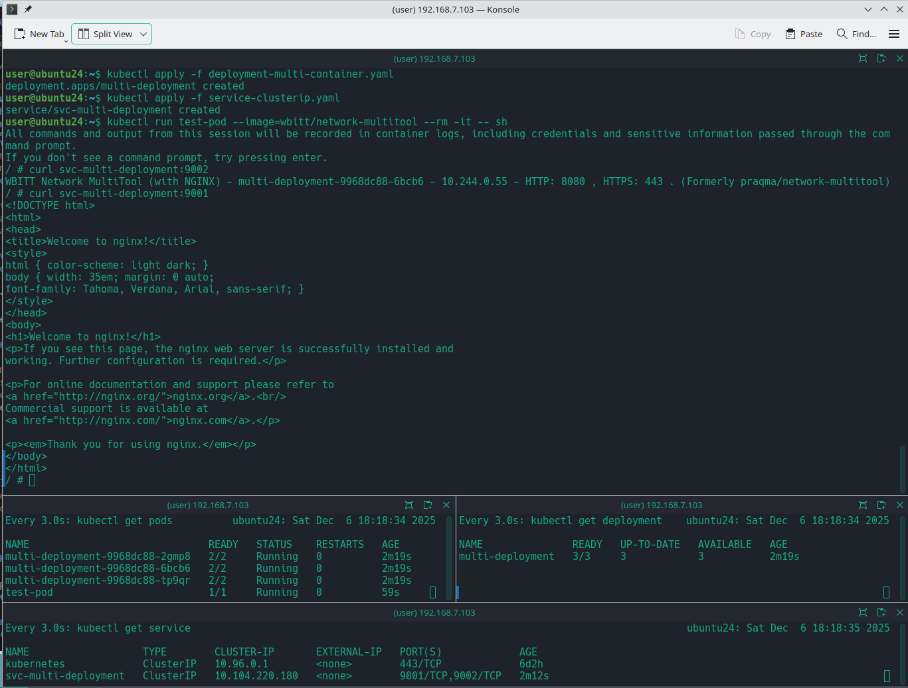
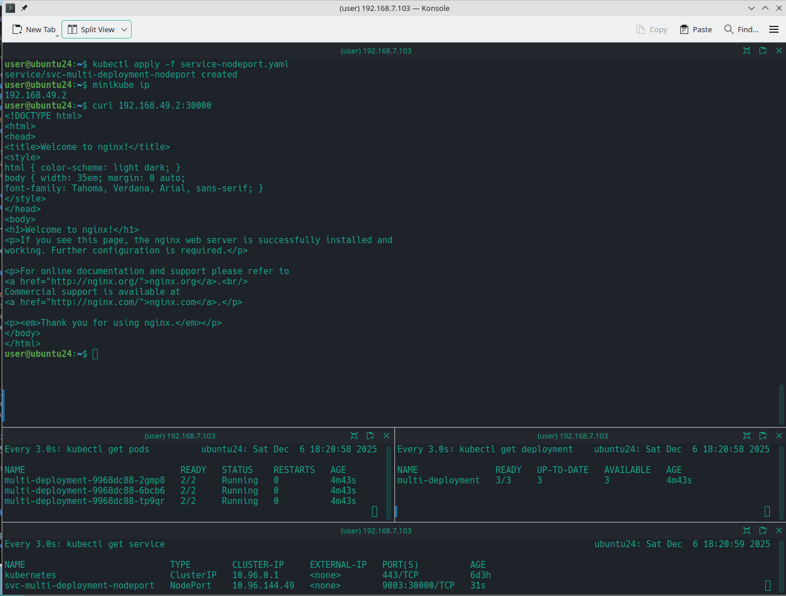
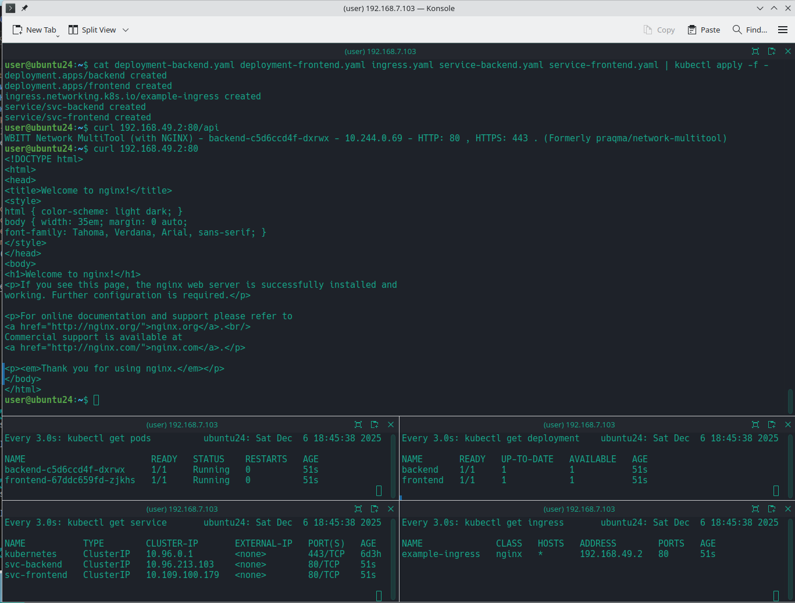

# Домашнее задание к занятию «Сетевое взаимодействие в Kubernetes» Бетко Алексей

## **Задание 1: Настройка Service (ClusterIP и NodePort)**
### **Задача**
Развернуть приложение из двух контейнеров (`nginx` и `multitool`) и обеспечить доступ к ним:
- Внутри кластера через **ClusterIP**.
- Снаружи через **NodePort**.

#### Ответ

Манифесты:

- [deployment-multi-container.yaml](task-1/deployment-multi-container.yaml)
- [service-clusterip.yaml](task-1/service-clusterip.yaml)
- [service-nodeport.yaml](task-1/service-nodeport.yaml)

Проверка clusterip

Проверка nodeport

---
## **Задание 2: Настройка Ingress**
### **Задача**
Развернуть два приложения (`frontend` и `backend`) и обеспечить доступ к ним через **Ingress** по разным путям.

#### Ответ

Манифесты:

- [deployment-frontend.yaml](task-2/deployment-frontend.yaml)
- [deployment-backend.yaml](task-2/deployment-backend.yaml)
- [service-frontend.yaml](task-2/service-frontend.yaml)
- [service-backend.yaml](task-2/service-backend.yaml)
- [ingress.yaml](task-2/ingress.yaml)

Проверка работы

